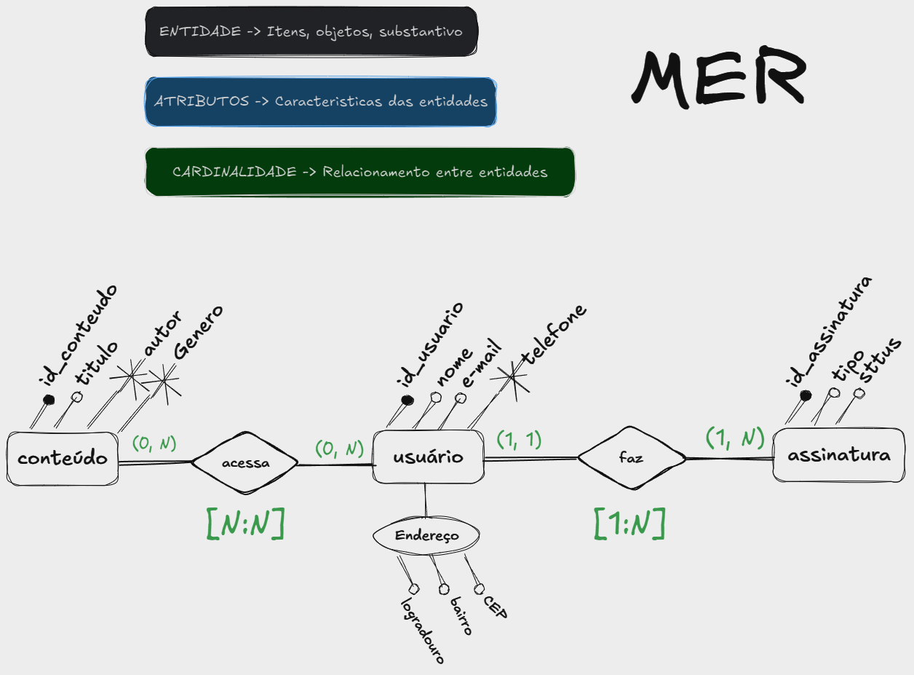
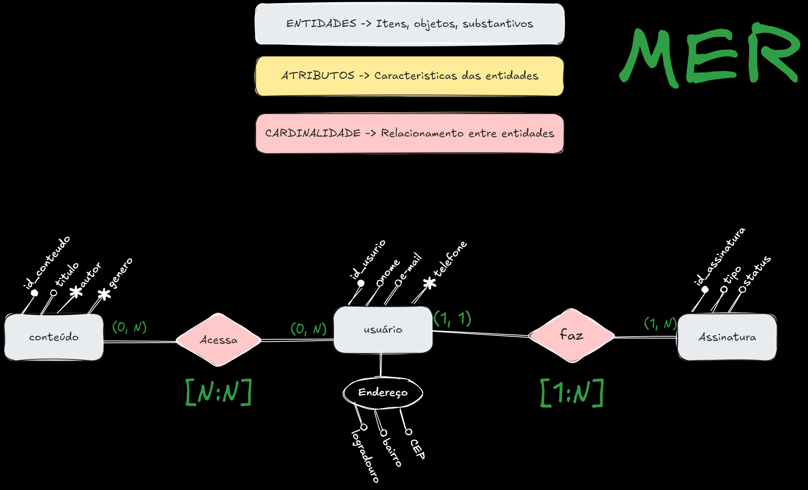
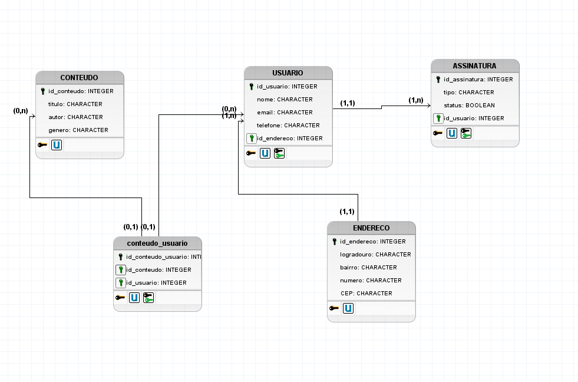

# Estudo de Caso: Sistema de Gerenciamento de Conteúdo Digital

## Descrição do Problema

Uma empresa deseja criar um sistema para gerenciar empréstimos de livros digitais (e-books) e audiolivros. Este sistema permitirá que os usuários façam o download ou o streaming de conteúdos após a realização de um cadastro e a aquisição de uma assinatura. O sistema também deve controlar a quantidade de licenças disponíveis para cada conteúdo e garantir que os usuários não excedam o número permitido de empréstimos simultâneos.

Os alunos devem colaborar no levantamento de requisitos com base nas necessidades do sistema, criando um banco de dados que permita organizar todas as informações necessárias. O projeto incluirá desde a identificação das entidades e seus relacionamentos até a modelagem lógica e física do banco de dados.

## Objetivos de Aprendizagem

Com este estudo de caso, os alunos deverão ser capazes de:

1. **Analisar Requisitos:** Trabalhar em conjunto para levantar os requisitos necessários para o sistema.
2. **Modelar Banco de Dados:** Criar um modelo *conceitual, lógico e físico* para armazenar todas as informações necessárias para o sistema.

---

## Material de Apoio
* [Como instalar o BRModelo](https://youtu.be/i_gNCwXM6pk)
* [Como instalar o MySQL e o Workbench no Windows](https://youtu.be/IEUgVwjXF0o)
* [Como instalar o MySQL e o Workbench no Ubuntu](https://youtu.be/Uuw4KPiVATc)
* [Como criar um banco de dados na AWS RDS](https://youtu.be/-5HyrZD7Wys)

## 1 - Levantamento de **requisitos**

### Perguntas para Levantamento de Requisitos
1. **Quais informações precisam ser armazenadas sobre os usuários?**
   - *Resposta*: Precisamos armazenar o nome, e-mail, senha, data de nascimento, endereço e o status da assinatura (ativa ou inativa).
2. **Como funcionará o sistema de assinatura dos usuários?**
   - *Resposta*: Os usuários precisarão adquirir uma assinatura mensal ou anual para ter acesso ao conteúdo. A assinatura será renovada automaticamente, e o sistema deve controlar a validade da assinatura.
3. **Quantos dispositivos podem acessar o conteúdo ao mesmo tempo com uma única assinatura?**
   - *Resposta*: No momento, cada usuário pode acessar o conteúdo em apenas um único dispositivo ao mesmo tempo.

4. **Há alguma limitação quanto ao número de conteúdos que um usuário pode acessar por vez?**
   - *Resposta*: Não há limite para o número de conteúdos, desde que seja dentro dos dispositivos permitidos e que o usuário possua uma assinatura ativa.

5. **Quais informações serão armazenadas sobre os livros digitais e audiolivros?**
   - *Resposta*: Precisamos armazenar o título, autor, tipo de conteúdo (e-book ou audiolivro), gênero, número de páginas ou duração.

6. **O sistema precisa controlar downloads e streaming?**
   - *Resposta*: Não, os usuários poderão acessar o conteúdo apenas via streaming na plataforma, sem opção de download.
  
7. **O sistema deve permitir recomendações personalizadas para os usuários?**
   - *Resposta*: Sim, o sistema deve sugerir novos conteúdos com base no histórico de empréstimos e nas preferências do usuário (por exemplo, gênero ou autor favorito).

8. **Como os usuários poderão buscar e filtrar os conteúdos disponíveis?**
   - *Resposta*: O sistema deve permitir que os usuários busquem por título, autor, gênero e avaliações. Também deve incluir filtros para categorias, como “mais populares” ou “novidades”.
  
9. **Como será o processo de notificação para os usuários sobre a validade da assinatura?**
    - *Resposta*: O sistema enviará notificações por e-mail ou através da plataforma, lembrando os usuários sobre a validade da assinatura e avisando sobre renovações ou falhas de pagamento.

10. **O sistema precisa limitar o tempo de inatividade antes de desconectar automaticamente o usuário?**
    - *Resposta*: Sim, por razões de segurança, o sistema deve desconectar automaticamente após 30 minutos de inatividade.

---

## 2 - Modelo Conceitual
- Turma 1

- Turma 2

## 2 - Modelo lógico

## 3 - Modelo físico

~~~SQL
create database livrocerto;
use livrocerto;

create table endereco (
	id_endereco integer auto_increment primary key,
    logradouro varchar(100),
    bairro varchar(100),
    numero varchar(100),
    cep varchar(8)
);

create table usuario (
	id_usuario integer auto_increment primary key,
    nome varchar(100) not null,
    email varchar(100) not null,
    telefone varchar(100),
    id_endereco integer,
    foreign key (id_endereco) references endereco(id_endereco) 
);

CREATE TABLE CONTEUDO (
  id_conteudo INTEGER auto_increment PRIMARY KEY,
  titulo VARCHAR(100),
  autor VARCHAR(100),
  genero VARCHAR(100)
);

CREATE TABLE conteudo_usuario (
  id_conteudo_usuario INTEGER PRIMARY KEY,
  id_conteudo INTEGER,
  id_usuario INTEGER,
  FOREIGN KEY (id_conteudo) REFERENCES CONTEUDO(id_conteudo),
  FOREIGN KEY (id_usuario) REFERENCES USUARIO(id_usuario)
);

CREATE TABLE ASSINATURA (
  id_assinatura INTEGER auto_increment PRIMARY KEY,
  tipo VARCHAR(100),
  status BOOLEAN,
  id_usuario INTEGER,
  FOREIGN KEY (id_usuario) REFERENCES USUARIO(id_usuario)
);

insert into 
	endereco (logradouro, bairro, numero, cep)
values
	('rua A', 'Jd. Villaca', '123','12345678'),
    ('Av. do patos', 'centro', '321', '8764321');
    
insert into
	usuario (nome, email, telefone, id_endereco)
values
	('maria', 'maria@gmail.com', '1234567', 1),
    ('pedro', 'pedro@yahoo.com.br', '767888', 2);
    
INSERT INTO 
	CONTEUDO (titulo, autor, genero) 
VALUES
	('Aventuras na Floresta', 'Jo das Neves', 'Fantasia'),
	('Mistério no Museu', 'Ana Maria', 'Suspense');
    
INSERT INTO 
	conteudo_usuario (id_conteudo_usuario, id_conteudo, id_usuario) 
VALUES
	(1, 1, 1),
	(2, 2, 2); 
    
INSERT INTO ASSINATURA 
	(tipo, status, id_usuario) 
VALUES 
	('anual', true, 1),
	('mensal', false, 2);

select * from endereco;
select * from usuario;
select * from CONTEUDO;
select * from conteudo_usuario;
select * from assinatura;

show tables;
~~~
